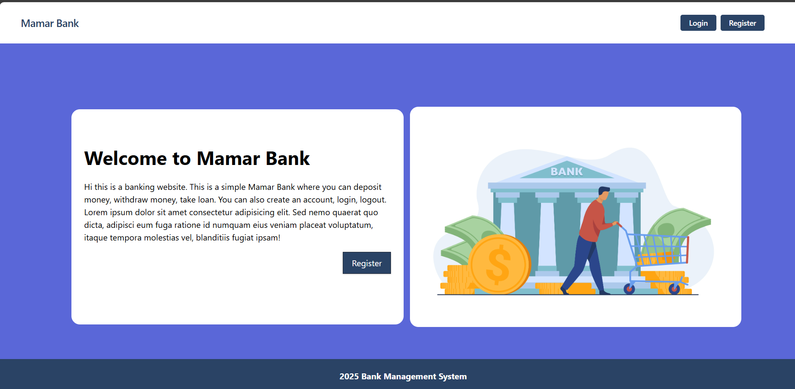
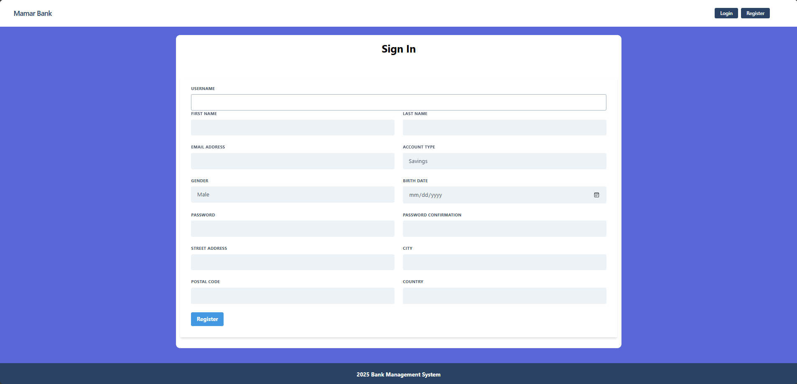
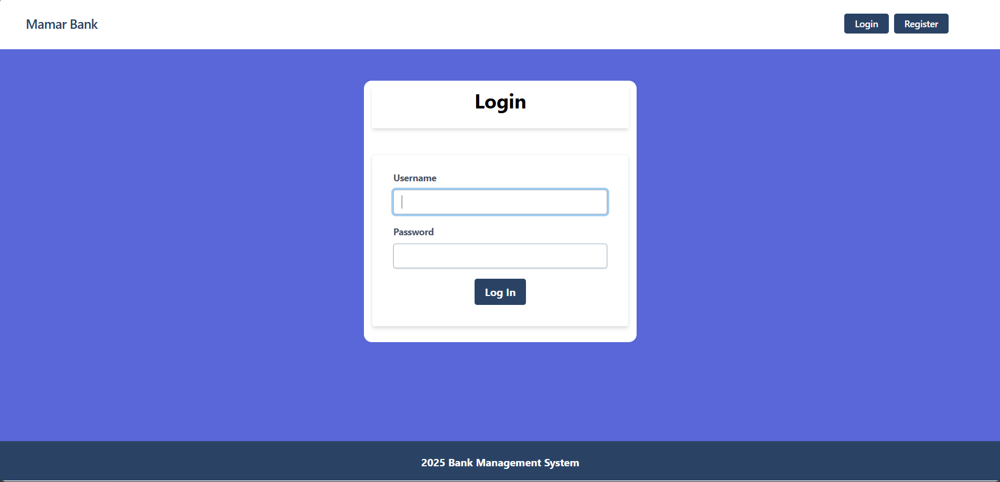
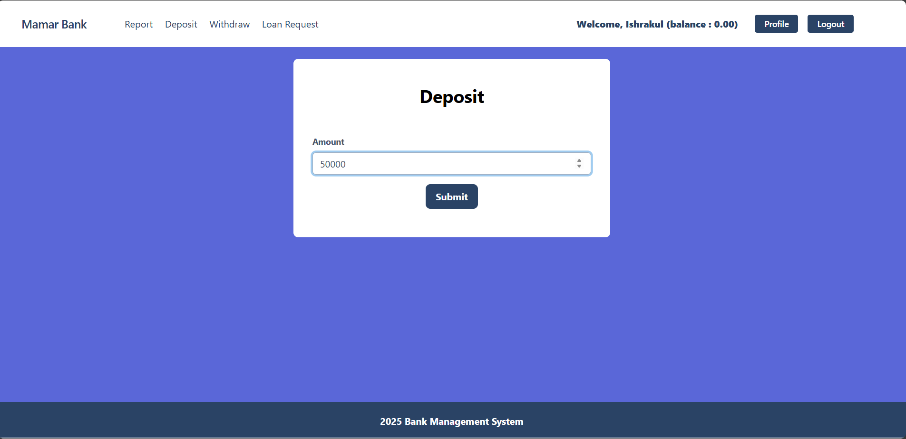
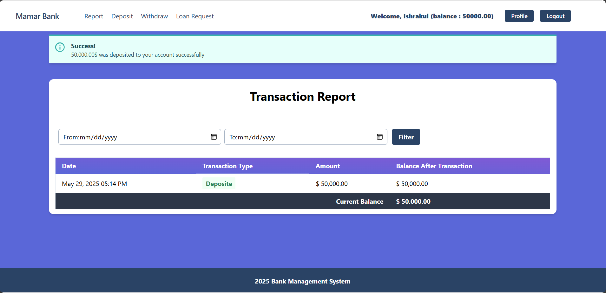
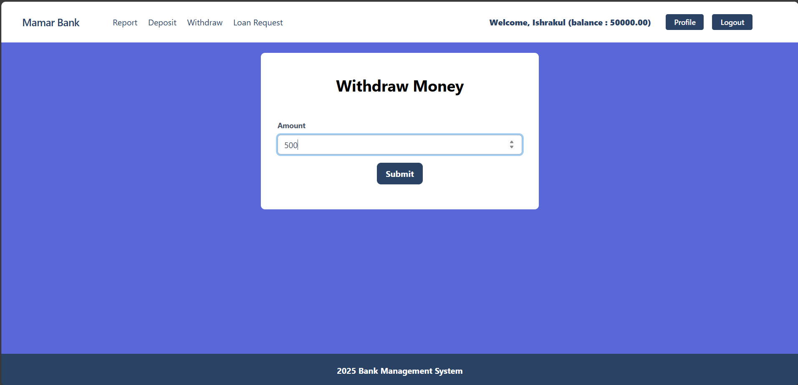
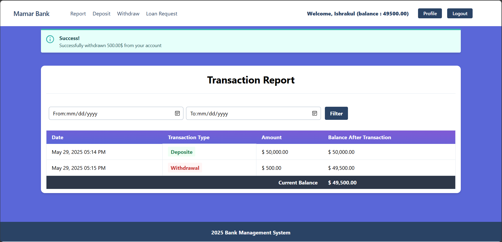
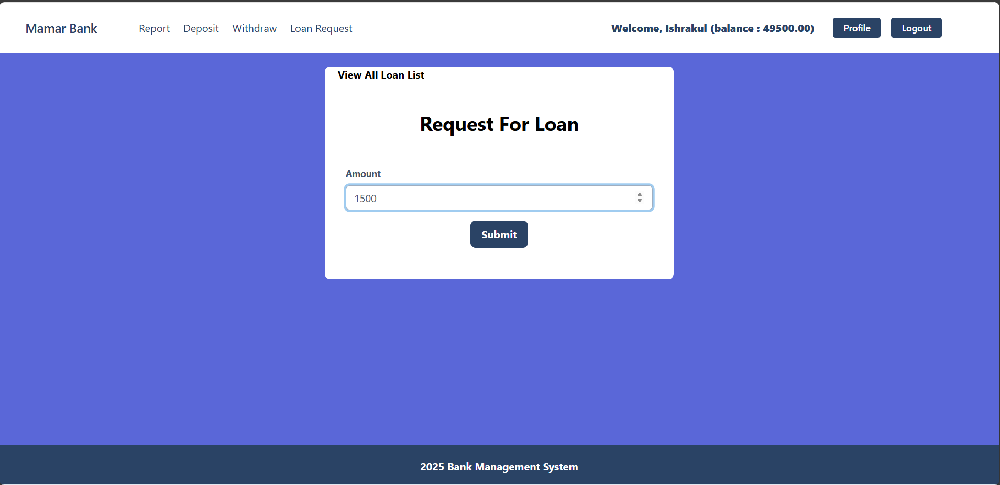
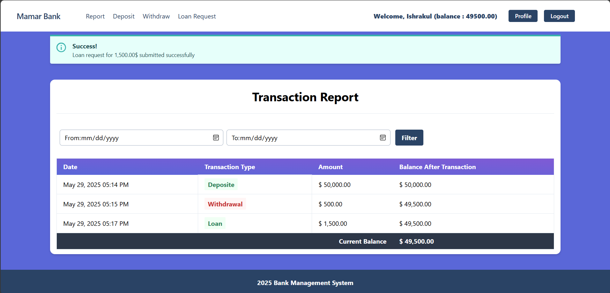

# Bank Management System

This is a Django-based Bank Management System project.  
It provides essential banking operations such as deposits, withdrawals, transfers, and loan management with role-based access and real-time email notifications.

---

## Features

- User registration, login, and role-based access control (admin and users)
- Deposit money into accounts
- Withdraw money from accounts
- Transfer money between accounts
- Loan application and management
- Real-time email notifications after each transaction
- Responsive UI with HTML templates
- PostgreSQL database for reliable data storage and transaction handling

---

## Technologies Used

- Python 3.x
- Django 5.2.1
- PostgreSQL
- HTML, CSS, Bootstrap-5
- Django’s SMTP email backend for notifications

---

## Project Setup and Installation

Follow these steps to set up and run the project locally:

### 1. Clone the repository

git clone https://github.com/Ishrakul-Tahmid/Bank-Management-System-Using-Django

cd mamar_bank

### 2. Create and activate a virtual environment

python -m venv room1

.\room1\Scripts\activate.bat


### 3. Install necessary packages

pip install -r requirements.txt

### 4. Configure PostgreSQL database

Update your `settings.py` with your PostgreSQL credentials:

DATABASES = {
    'default': {
        'ENGINE': 'django.db.backends.postgresql',
        
        'NAME': 'your_db_name',
        'USER': 'your_db_user',
        'PASSWORD': 'your_password',
        'HOST': 'localhost',
        'PORT': '5432',
    }
}

### 5. Apply database migrations

python manage.py makemigrations

python manage.py migrate

### 6. (Optional) Create a superuser for admin access

python manage.py createsuperuser

Follow the prompts to create admin credentials.

### 7. Run the development server

python manage.py runserver


## Project Structure Overview

* mamar_bank/ — main Django project folder

  * settings.py — project settings including database and email configurations
  * urls.py — project-level URL routing
* accounts/ — user authentication and role management

  * models.py — user-related models
  * views.py — user registration, login, logout, and profile
  * urls.py — accounts-related URL routing
* transactions/ — deposit, withdrawal, and transfer logic

  * models.py — transaction models
  * views.py — transaction handling views
  * urls.py — transaction URLs
* loans/ — loan application and management

  * models.py — loan models
  * views.py — loan-related views
  * urls.py — loan URLs
* templates/ — HTML templates for UI
* static/ — static files like CSS and JavaScript
* manage.py — Django management script


## Admin Panel

You can manage users, transactions, loans, and other data through the Django admin panel at:

[http://127.0.0.1:8000/admin/]

Use the superuser credentials to log in.

```
## Email Notification Setup

Configure your email backend in `settings.py` for sending notifications:

EMAIL_BACKEND = 'django.core.mail.backends.smtp.EmailBackend'
EMAIL_HOST = 'smtp.your-email-provider.com'
EMAIL_PORT = 587
EMAIL_USE_TLS = True
EMAIL_HOST_USER = 'your-email@example.com'
EMAIL_HOST_PASSWORD = 'your-email-password'
DEFAULT_FROM_EMAIL = 'your-email@example.com'
```
---

## Project Views (Example Screenshots)

> * User dashboard


> * Regestration


> * Login


> * Deposit

After Deposit Transaction Report:

> * Withdraw

After Withdraw Transaction Report: 

> * Loan application page

After Withdrad Transaction Report: 
** Loan request is added to the transaction report if admin panel approve it from the backend.

---

## Get Project Live at

https://bank-management-system-using-django.onrender.com/

---

Thank you for checking out this project!

